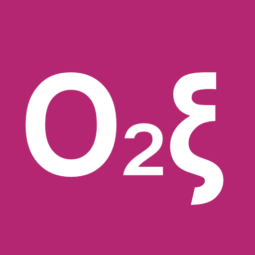
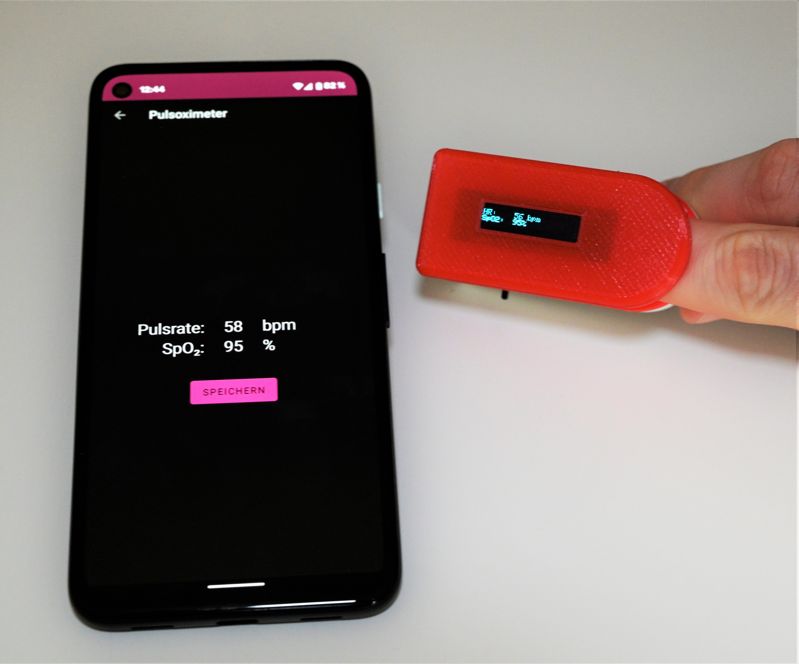
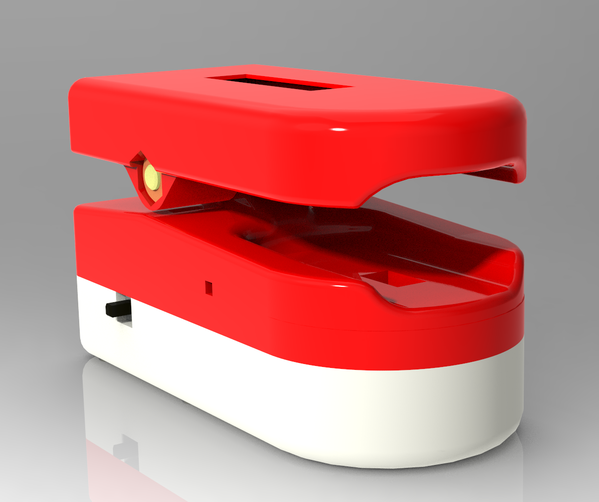
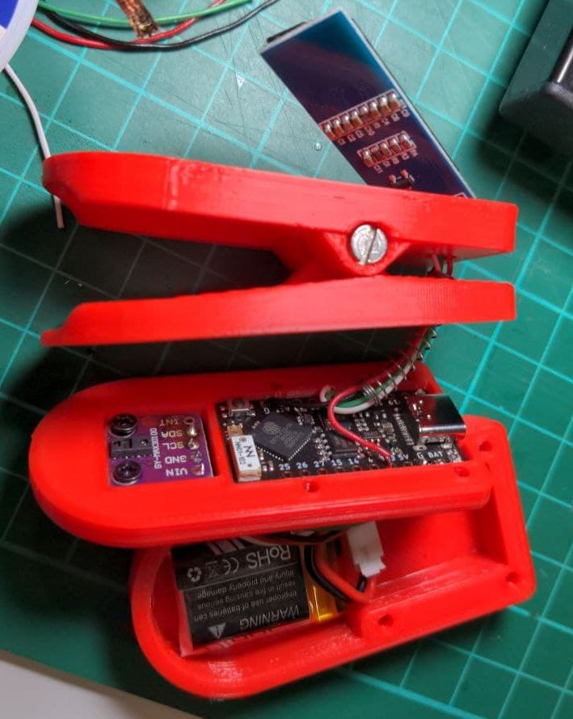
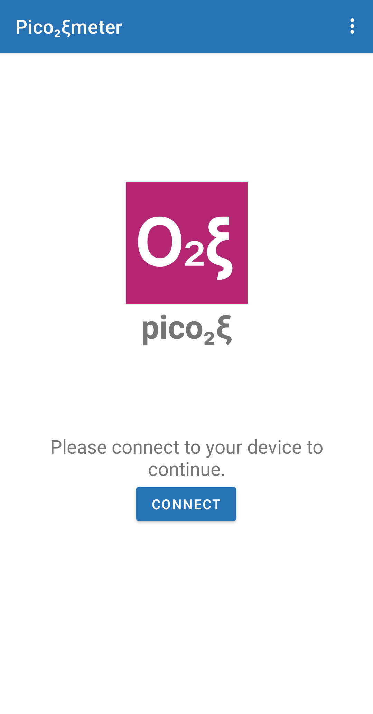
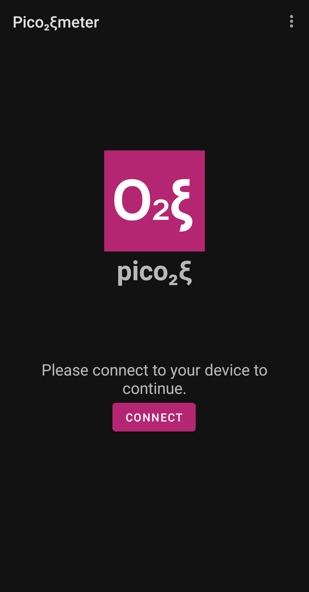

# Pic0₂ξmeter

## Information
The Picoximeter is a TinyPico based pulse oximeter. It sends data to an OLED screen and you can connect to it with the app via BLE.

## Device
### Hardware
The pulse oximeter is based on a 3D printer case with a TinyPico, MAX30100 (Purple PCB), 128x64px OLED Screen, a sliding switch, a 220mAh battery and a spring from a pen. A different microcontroller with the same form factor could work as well i.e. an Adafruit ItsyBitsy though I have not tried that. This might compromise BLE functionally.

The stl files for the print are available in the repo. Please note that the tolerances of an 0.4mm nozzle are already accounted for. If you have problems with the tolerances I would recommend the "Expand horizontal" setting in Cura or a comparable setting in another slicer.
The soldering can be difficult for beginners as the space is quite narrow though it is possible with a basic soldering iron.

### Software
The code is writen in Arduino and mainly based on the examples given for the MAX30100, OLED and BLE libraries used. Those are available through the library manager by oxullo (MAX30100) and Adafruit (OLED), the BLE libraries come with the ESP32 board manager.

## App
The app is written in Java with Android Studio, the source code is provided. It has functionality for connecting to the device and reveiving updates when new data is available. The data can be stored and tagged. This data can be accessed via the home screen menu to be sorted, deleted and to edit the tag on a reading. Basic instructions are provided through mentioned menu as well.
The app is mainly focused on use in portrait mode, only some functionality has basic landscape layouts.

## License
I have not decided on one yet, but use commons sense when modifying and using the data provided i.e. mentioning my name on use - especially for the CAD model, Android app and any graphics.
